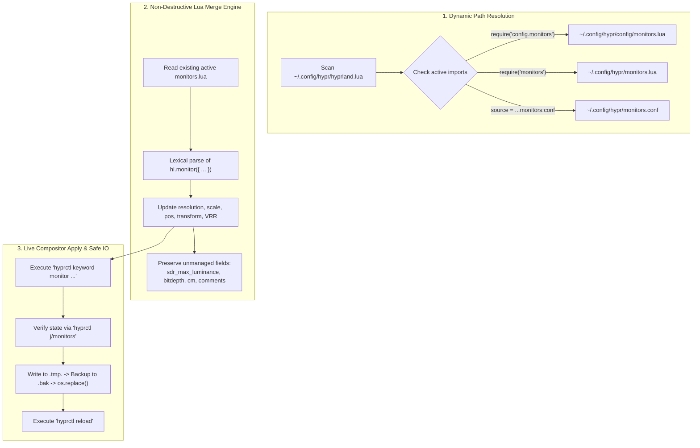

# Fork Overview: nwg-displays (CachyOS & Modular Hyprland Lua Edition)

**Fork Maintainer:** [zfzfg (Collin Lerche)](https://github.com/zfzfg)  
**Upstream Repository:** [nwg-piotr/nwg-displays](https://github.com/nwg-piotr/nwg-displays) (v0.4.4 baseline)  
**Fork Repository:** [zfzfg/nwg-displays](https://github.com/zfzfg/nwg-displays)  
**Branch:** `fix/hyprland-modular-lua-config`

---

## 1. Executive Summary & Motivation

Upstream `nwg-displays` is a graphical output management utility for Sway, Niri, and Hyprland. While Hyprland has transitioned towards Lua-based configuration in versions 0.55 and 0.56+, modern distributions like **CachyOS** utilize a modular configuration structure where `hyprland.lua` imports submodules such as `require("config.monitors")` (stored at `~/.config/hypr/config/monitors.lua`), rather than a flat `~/.config/hypr/monitors.lua` or `monitors.conf`.

Furthermore, users with advanced displays (OLED/HDR monitors, high refresh rates, mixed orientations) previously experienced:
1. **Destructive overwrites**: High dynamic range (HDR) settings such as `sdr_max_luminance = 400`, `bitdepth = 10`, `cm = "hdr"`, and user comments were permanently erased when applying settings.
2. **Ignored changes ("Apply did nothing")**: Hardcoded paths wrote to unused configuration files, and compositor state was not updated live.
3. **Broken GUI Canvas Dragging**: On Wayland, displays in vertical orientations (e.g. 1080x1920 or 1200x1920) became vertically immobile (`max_y = 0`), and mouse drags suffered from severe stuttering due to recursive spinbutton feedback loops and Wayland root coordinate drift.

This fork addresses each of these architectural limitations while preserving 100% backward compatibility with Sway, Niri, and standard Hyprland installations.

---

## 2. Architecture & Data Flow



---

## 3. Detailed Changes by Module

### A. New Module: `nwg_displays/hyprland_helper.py`
A dedicated helper module handling all Hyprland modular Lua interactions:

* **Dynamic Config Path Detection (`detect_hyprland_monitors_path`, `detect_hyprland_workspaces_path`)**:
  - Scans `hyprland.lua` line-by-line using quote-aware lexical patterns.
  - Correctly ignores commented-out requires (`-- require(...)`), supports calls without parentheses (`require "module"`), and resolves CachyOS modular paths (`require("config.monitors")` -> `~/.config/hypr/config/monitors.lua`).
  - Emits descriptive warnings if the detected file is not actively imported in `hyprland.lua`.
* **Lexical Parser (`parse_existing_lua_monitors`, `strip_lua_comment`)**:
  - Extracts each `hl.monitor({ ... })` declaration and tokenizes its key-value pairs without executing arbitrary Lua code.
  - Cleanly separates values from inline comments (`-- comment`), preventing invalid Lua syntax or corrupted hyprctl commands.
* **Non-Destructive Generator (`merge_and_generate_lua`)**:
  - Updates GUI-controlled properties: `name`, `resolution`, `offset`, `scale`, `transform`, `vrr`, `mirror`, `bitdepth`, `cm`, `sdr_brightness`, `sdr_saturation`.
  - Preserves extended monitor properties such as `sdr_max_luminance = 400`, block/inline comments, and custom compositor options.
  - Preserves unplugged/unmanaged monitor configurations present in `monitors.lua`.
  - Avoids polluting standard SDR monitors with default `sdr_max_luminance = 80`.
* **Live Compositor Apply (`generate_hyprctl_keyword_commands`)**:
  - Generates real-time commands (e.g. `hyprctl keyword monitor DP-3,2560x1440@300.0,1200x384,1.25,vrr,0,cm,hdr,sdr_brightness,1.0,sdr_saturation,1.0,bitdepth,10`).
  - Applies configurations immediately without requiring compositor restart.
* **Verification Engine (`verify_live_monitors`)**:
  - Queries `hyprctl j/monitors` following keyword commands to confirm that resolution, logical offset, and active status match the target state.
  - Emits visible desktop notifications (`notify`) if verification encounters discrepancies.
* **Atomic File Writer (`atomic_write_file`)**:
  - Writes to a temporary file on the same filesystem (`.tmp.<pid>`).
  - Creates a `.bak` copy of the original file.
  - Safely replaces the destination using `os.replace` to eliminate partial-write or crash corruption risks.

---

### B. Settings Applier: `nwg_displays/settings_applier/settings_applier.py`
* **Modular Lua Integration**:
  - Refactored `_apply_hyprland_gui` and `_apply_hyprland_json` to utilize `hyprland_helper.py`.
  - Replaces legacy destructive string templates with the merge engine.
  - Dispatches desktop warning notifications on post-apply verification mismatch.
* **Rollback Safety**:
  - Supplies full 4-tuple backups `(backup_conf, backup_lua, conf_path, lua_path)` to the GUI confirmation dialog.
  - On timeout or cancellation, restores the exact modular Lua file and reloads Hyprland.

---

### C. Display Data Extractor: `nwg_displays/tools.py`
* **Extended Property Extraction (`list_outputs`)**:
  - Parses `sdrMaxLuminance` from `hyprctl monitors -j` output.
  - Only stores `sdr_max_luminance` for genuine HDR modes (> 80 nits), preventing standard SDR displays from being polluted with redundant 80 nit directives.

---

### D. GUI & Canvas Drag-and-Drop: `nwg_displays/main.py` & `main.glade`

The visual monitor canvas was overhauled to resolve dragging and responsive issues:

1. **Wayland-Native Coordinate Translation**:
   - *Previous issue:* Relied on `p.get_window().get_position()` (which returns `(0, 0)` under Wayland) and `event.x_root` (which is relative to the top-level window, causing offset drift).
   - *Fix:* Directly uses GTK's container coordinate mapping:
     ```python
     coords = widget.translate_coordinates(fixed, event.x, event.y)
     raw_x = coords[0] - grab_offset_x
     raw_y = coords[1] - grab_offset_y
     ```
2. **Recursive Signal Feedback Elimination**:
   - *Previous issue:* In `on_motion_notify_event`, updating spinbuttons triggered `on_pos_x_changed` and `on_pos_y_changed` on every mouse event, calling `fixed.move()` with rounded coordinates and causing severe jitter.
   - *Fix:* Introduced `is_dragging` and `updating_form` flags. All form handlers return early when a drag or form update is in progress.
3. **Canvas Size & Expansion (`max_y = 0` trap)**:
   - *Previous issue:* In `main.glade`, `wrapper` had `<property name="expand">False</property>`, and `fixed` had no size request. For portrait monitors (e.g. 1920px rotated at 0.15 scale = 288px), the canvas height was exactly 288px, locking `max_y = 288 - 288 = 0`.
   - *Fix:* Set `wrapper` packing expand to `True`, set hexpand/vexpand, and introduced `update_canvas_size()` requesting a minimum of 1200x500px with generous margins around all displays.
4. **Button Release Handling**:
   - Added `Gdk.EventMask.BUTTON_RELEASE_MASK` and connected `on_button_release_event` to cleanly finalize placement, snap coordinates, and synchronize UI state.
5. **Nearest-Line Edge Snapping**:
   - Evaluates all candidate edges (left, right, top, bottom) against neighboring displays and snaps to the true minimum distance within threshold.
6. **Modular Workspaces Rule Generation (`on_workspaces_apply_btn_hypr`)**:
   - Safely writes `hl.workspace_rule({ ... })` to modular `.lua` workspace files using `atomic_write_file`, preventing file format confusion or crashes.

---

## 4. Test Suite & Verification

The test suite contains **22 automated unit tests** across three test modules:

```text
$ python -m unittest discover -s tests -p "test_*.py" -v
test_default_upstream_path_versus_detected_cachyos_config (test_cachyos_reproduction.TestCachyOSReproduction.test_default_upstream_path_versus_detected_cachyos_config) ... ok
test_fixed_modular_lua_writes_active_cachyos_config_and_preserves_hdr (test_cachyos_reproduction.TestCachyOSReproduction.test_fixed_modular_lua_writes_active_cachyos_config_and_preserves_hdr) ... ok
test_fixed_three_monitor_reference_setup (test_cachyos_reproduction.TestCachyOSReproduction.test_fixed_three_monitor_reference_setup) ... ok
test_canvas_size_updater (test_canvas_dragging.TestCanvasDragging.test_canvas_size_updater) ... ok
test_drag_event_lifecycle_and_flags (test_canvas_dragging.TestCanvasDragging.test_drag_event_lifecycle_and_flags) ... ok
test_spinbutton_feedback_loop_isolated (test_canvas_dragging.TestCanvasDragging.test_spinbutton_feedback_loop_isolated) ... ok
test_apply_from_gui_hyprland_flow (test_hyprland_helper.TestHyprlandHelper.test_apply_from_gui_hyprland_flow) ... ok
test_atomic_write_file (test_hyprland_helper.TestHyprlandHelper.test_atomic_write_file) ... ok
test_detect_cachyos_modular_lua (test_hyprland_helper.TestHyprlandHelper.test_detect_cachyos_modular_lua) ... ok
test_detect_ignores_commented_requires_and_supports_no_parens (test_hyprland_helper.TestHyprlandHelper.test_detect_ignores_commented_requires_and_supports_no_parens) ... ok
test_detect_legacy_conf (test_hyprland_helper.TestHyprlandHelper.test_detect_legacy_conf) ... ok
test_detect_upstream_lua (test_hyprland_helper.TestHyprlandHelper.test_detect_upstream_lua) ... ok
test_disabled_and_mirrored_monitor_generation (test_hyprland_helper.TestHyprlandHelper.test_disabled_and_mirrored_monitor_generation) ... ok
test_generate_hyprctl_keyword_commands (test_hyprland_helper.TestHyprlandHelper.test_generate_hyprctl_keyword_commands) ... ok
test_merge_and_generate_lua_preserves_hdr_properties (test_hyprland_helper.TestHyprlandHelper.test_merge_and_generate_lua_preserves_hdr_properties) ... ok
test_on_workspaces_apply_writes_modular_lua (test_hyprland_helper.TestHyprlandHelper.test_on_workspaces_apply_writes_modular_lua) ... ok
test_parse_existing_lua_monitors (test_hyprland_helper.TestHyprlandHelper.test_parse_existing_lua_monitors) ... ok
test_parse_inline_comments_and_hyprctl_commands (test_hyprland_helper.TestHyprlandHelper.test_parse_inline_comments_and_hyprctl_commands) ... ok
test_preserve_unmanaged_unplugged_monitors_in_merge (test_hyprland_helper.TestHyprlandHelper.test_preserve_unmanaged_unplugged_monitors_in_merge) ... ok
test_sdr_display_does_not_get_sdr_max_luminance_80 (test_hyprland_helper.TestHyprlandHelper.test_sdr_display_does_not_get_sdr_max_luminance_80) ... ok
test_unincluded_config_detection (test_hyprland_helper.TestHyprlandHelper.test_unincluded_config_detection) ... ok
test_verify_live_monitors (test_hyprland_helper.TestHyprlandHelper.test_verify_live_monitors) ... ok

----------------------------------------------------------------------
Ran 22 tests in 0.010s

OK
```

### Coverage Highlights:
- **`tests/test_cachyos_reproduction.py`**: Verifies path detection and HDR preservation on real-world multi-monitor CachyOS configurations.
- **`tests/test_hyprland_helper.py`**: Validates parsing, merging, atomic replacement, and live keyword generation.
- **`tests/test_canvas_dragging.py`**: Validates drag event lifecycle, feedback loop isolation, and dynamic canvas resizing.

---

## 5. Git Commit History

The fork maintains a clean, isolated commit history on branch `fix/hyprland-modular-lua-config`:

```text
cea21c6 fix(gui): enhance canvas dragging, prevent spinbutton feedback loop, and expand canvas size
76126f1 fix: support modular Hyprland Lua configs, preserve HDR options, and apply live
fd79522 (tag: v0.4.4, upstream/master) bump to 0.4.4
```

---

## 6. How to Run and Verify

```bash
# Clone the fork (or checkout within workspace)
git clone -b fix/hyprland-modular-lua-config https://github.com/zfzfg/nwg-displays.git
cd nwg-displays

# Run unit tests
python -m unittest discover -s tests -p "test_*.py" -v

# Launch the application
python -m nwg_displays.main
```
